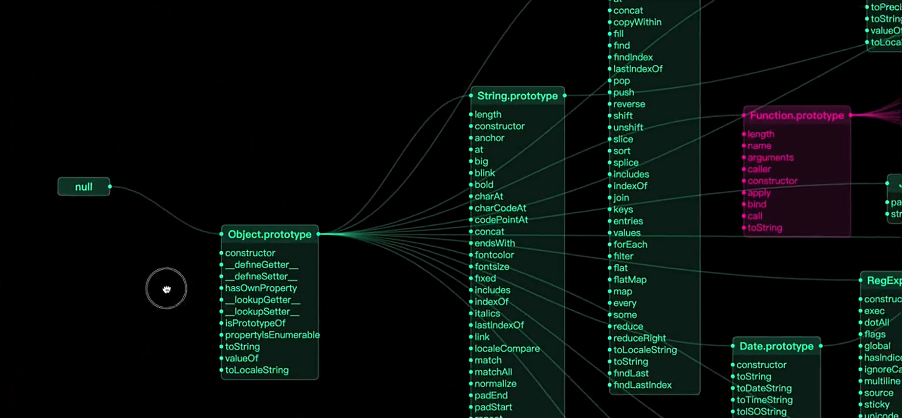
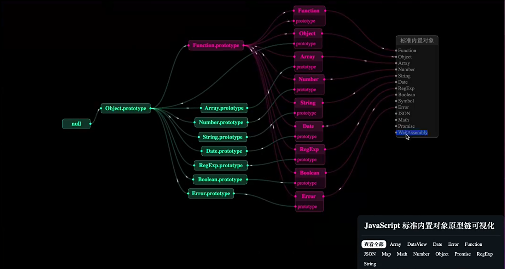

# PrototypeChain Visulization Project

[中文版](./README.zh.md)

## 项目预览

## version

> 1.0

## Effect

## 📖Usage Instructions:

My Prototype Chain Visualization Project
Version 1.0 is open source
Come and experience it~
Access address: [Online Access](https://zhouyu2156.github.io)

Currently supported features:
🔎1. Enter the JS built-in object name in the input box, click the 'Search' button to quickly find the corresponding MDN document, and press' Enter 'to view the prototype chain object structure

🟩2. Support dragging cards

🧩3. Press and hold the 'spacebar' to move the canvas

🧸4. Double clicking the card title can also quickly search for the MDN document corresponding to the object

🪄5. You can click on the attribute text listed on the card to continue viewing the information of that attribute

🔄6. Support scrolling to move the canvas

🎨7. Support card color palette

## 🙋‍♂️What I want to say

I think this project is very meaningful and I hope everyone can actively join in to complete a great work together. 
I think this prototype chain display is not just about front-end, but can also be extended to visualize data in many other aspects, of course, this is just an introduction. 

In short, we sincerely hope that everyone can actively participate in the further development of this project, continuously enrich its functions, and make it better serve all technical personnel.

## 📧Contact Me

💬QQ：1043744584

📧Email：1043744584@qq.com

👾Github：[zhouyu2156](https://github.com/zhouyu2156)

🌐Personal Blog：[ZhouYu's Blog](https://www.zhouyu2156.cn/)
